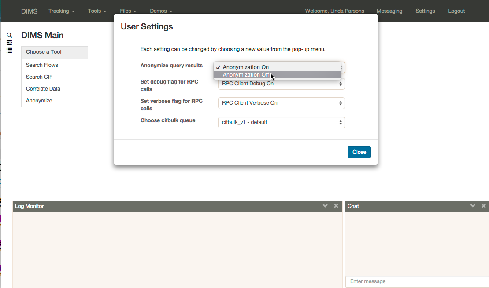

.. dimsdashboarduidesign:


=========================================
DIMS Dashboard User Interface (UI) Design
=========================================

This document presents the working design of the DIMS Dashboard user interface
(UI). It provides descriptions of user workflows, user capabilities, user views,
and functional capabilities. These are derived from the DIMS Software
Requirements Specification and CONOPS as well as discussions with prototypical
users.

This information in turn drives the creation of UI mockups (also included) which
serve as the basis for the final design implementation. JIRA tickets (user
stories and tasks) to perform the implementation are derived from this document.

This is a work-in-progress and will be updated frequently. Items still to be
decided are TBD. Items to be added are TBA. Questions are asked where
information/decisions are needed and alternative options are given when a course
of action has not been determined.

.. contents::
   :depth: 3


User Types 
----------

DIMS Dashboard users can be divided into two broad groups: Users and
administrators. Therefore we define two types of users:

user 
   This is the prototypical user: Cyber-analyst, investigator, security
   professional, PRISEM participant, Ops-trust member, etc. A "user" does not 
   have access to "admin" views.

admin
   Performs system administration functions on the DIMS system as a whole.
   Responsible for daily operations of the system, provisioning of machines and
   users, etc. An "admin" has access to "user" and "admin" views.


Views 
-----

This section describes the "views" or "pages" available to each type of user,
starting with the "Dashboard" view. These views are based upon user worflows and  capabilities.

Dashboard View 
~~~~~~~~~~~~~~

This section concerns the initial view presented to a user upon login - the
overview presented to the user. This is still TBD, but some ideas follow.
Suppose it is a view with panels (boxes) that represent various content areas of
interest to the user. We need to determine what those content areas are. Can the
user "move" them around (change placement)? Can the user specify content areas
to add to the initial dashboard view? What happens when a user clicks on an
area?

The dashboard view presented depends on the user type: "admin" or "user".

User Dashboard View 
```````````````````

The following are proposed content areas for the User Dashboard View. Each would
contain some kind of relevant data pertaining to the content area or a graphic
representative of the content area.

#. Chat

   * Opens the chat view.

#. Search/Query

   * Opens the query view 
   * In terms of the current implementation, this
     could take the user to the current main page with the query (Magnifying
     glass) view active.

#. Tickets

   * Opens the ticket interface - view/create/etc. 
   * Current implementation -
     could take the user to the current main page with the ticket view active

#. User Saved Data/Queries

   * Opens the interface (currently on the main page, user saved searches view)
     to the user's saved searches/data

#. Notifications

   * Opens the interface (not currently implemented) which would list any
     notifications for the user.

#. Wiki

   * Opens the wiki. Note: currently the wiki is part of ops-trust and can only
     be accessed via the ops-trust portal. 

#. User Attributes/Profile

   * Opens the user attributes interface. This could also include User profile
     information (currently only accessible via ops-trust) and the user
     settings.

#. Associated Applications - could have a separate content area/panel for each.
   Ideas:

   * ops-trust portal 
   * Kibana  (is this needed for users or is it admin only?)
   * PRISEM portal


Other possibilities, if they will significantly add to the user experience:

#. Last activity

   * Takes the user to the last activity the user was working on (last Dashboard
     content area/panel for example)

#. Favorites

   * Perhaps one or more "slots" could be configured where the user can save a
     favorite view - a ticket he/she is working on for example. For a ticket,
     for example, clicking on the box would take the user to the ticket 
     interface with the ticket selected and visible.


Admin Dashboard View 
````````````````````

The admin dashboard could consist of a subset of the user content areas, plus
content areas of particular interest to systems administrators, which would
appear first on the page. Some ideas follow for the admin-specific areas. Note
that these capabilities (admin views) do not exist yet and have not been defined
as to whether they are dashboard capabilities or capabilities for other parts of
the system.

#. Operational state of system components (very important)

   * See section 4.8 of the SRS

#. View logs

   * Perhaps go to a Kibana view of available logs, or to a view where logs can
     be selected to view or search

#. User Administration

   * Go to user administration view - need to be able to give/remove access to
     users, modify user type, regenerate keys, etc. (see SRS 4.11)

#. TBD…


Navigation Bar 
~~~~~~~~~~~~~~

A fixed horizontal navigation bar is present on any view. At a minimum, it will
contain the following when a user is logged in:

#. Link to Dashboard view 
#. Text indicating logged in user
#. Logout link

The current implementation also includes

#. Link to open Messaging modal window
#. Link to open Settings modal window
#. Navigation menus - These may be modified or removed as required by revised
   mockups (TBA)

A non-logged in user will only see the text "DIMS" in the navigation bar - no
links.


Messaging Views 
~~~~~~~~~~~~~~~

Messaging involves two basic views:

#. Modal window to start/stop messaging ("Messaging Control View")
#. For each type of messaging, window to display messaging contents and to 
   send content if the messaging type supports it.

We currently support two types of messaging:

#. Log monitor - monitors messages on the "logs" exchange. Receive only.
#. Chat - Send and receive.

While we currently only have one type of log monitoring (that of the "logs" 
exchange), we may want to add more exchanges to monitor. Therefore, views for 
log monitoring need to be able to support additional types of logs. (For 
example, if the current view for log monitoring is adopted, additional
logs could appear in "tabs". ) The modal window design also needs to be able
to support addional logs to turn on/off.

To view requirements for messaging, see the section "Messaging" in this 
document.

Messaging Control View 
``````````````````````

Log Monitor View 
````````````````

Chat View 
`````````

User Views
~~~~~~~~~~

The following are elements that would be reached/modified via one or more types
of "user" views:

#. User settings - Persistent settings associated with the user that control
   what the user can do on the site
#. User attributes - Sets of attributes that the system can use to inform me
   of new data that matches those attributes, such as CIDR blocks, domain names,
   etc.
#. User profile - 

User Workflows
--------------

Workflows and user actions/capabilities based upon SRS Use cases follow.

Multiple sets of Attributes (SRS 4.1)  - DIMS-52
~~~~~~~~~~~~~~~~~~~~~~~~~~~~~~~~~~~~~~~~~~~~~~~~

1. User views attributes assigned 
2. User updates attributes

Initial ToDo:

1. Define the attributes we will track initially.


Track cases and campaigns (SRS 4.2) - DIMS-53
~~~~~~~~~~~~~~~~~~~~~~~~~~~~~~~~~~~~~~~~~~~~~

1. User "marks" tickets to track.
2. User views list of tickets being tracked. User can see the date of the last
   time each ticket was viewed in the listing. 
3. User views a tracked ticket and the new topics or updated topics are
   displayed first in descending time order and are marked in some way (to 
   differentiate them in the display from older topics)


Notifications (SRS 4.3) - DIMS-54
~~~~~~~~~~~~~~~~~~~~~~~~~~~~~~~~~

1. User views notifications (list) in descending time order 
2. User clicks a
   notification and views it

   * Notification may reference a ticket, such as in the case of the mitigation
     scenario. 
   * User views list of hosts involved

Note: Notifications in this use case are triggered by the system "receiving" a
list of indicators. Perhaps whenever something happens that would trigger a
"notification", a ticket should be always be associated with it, as happens in
the mitigation scenario.

Save Query Results (SRS 4.4) - DIMS-55
~~~~~~~~~~~~~~~~~~~~~~~~~~~~~~~~~~~~~~

1. User performs a query. 
2. User optionally modifies the result set (e.g. uses
   histogram or graph slider to identify a subset of the data) 
3. User does one of the following:

   * User chooses to save the query and result to an existing ticket 
   * User chooses to save the query and result to a new ticket 
   * User chooses to save the query and result "locally"

4. User can optionally further refine the results, and repeat #3 if desired

Note: "Locally" refers to being able to save results without "publishing" them
to a ticket, which would make them available for sharing. Think of them as
"drafts" or a user's workspace/sandbox/etc. So, do we need this capability, or
should everything be saved to tickets?   In essence, "locally" saved results are
a type of ticket - just visible to the owner.  Does the user need the ability to
save results/files/data/etc where the saved items are only visible to the user?


Timestamp Files (SRS 4.5) - DIMS-56
~~~~~~~~~~~~~~~~~~~~~~~~~~~~~~~~~~~

1. User creates and uploads a file 
2. User associates the file with a ticket ("Data" type) so it can be stored in 
   redis (or other datastore - the user is unaware of how the data is stored) 
3. User applies the timestamp to the file

   * Via some UI control - button/etc. 
   * System creates the timestamp and stores it

Note: 1, 2, and 3 could all be part of one form.


Host Context (SRS 4.6) - DIMS-58 
~~~~~~~~~~~~~~~~~~~~~~~~~~~~~~~~

User workflow TBD. Looks like a user should be able to enter a host (ip or
hostname) into a form, press a button, and the system should do the appropriate
queries to generate the data representations described in this use case.  Are
there any other user actions that need to take place to generate the
visualization? Are there user actions that need to be available in order to
refine, modify, save any relevant data?

Visualizations:

1. Malicious activity observed

   * By whom 
   * Start and stop times

2. Correlation of that activity to other incidents the user has "dealt with"

   * Need to define how that is done - what pool of incidents/tickets is
     queried.  How is it determined if a user has "dealt with" a previous
     incident. Can this be accomplished by simply correlating against tickets 
     the user is tracking?

3. Timeline: Y axis: sources, X axis - first/last seen times 
4. Map hosts in some way - group by AS, etc.


Data Drill-Down (SRS 4.7) - DIMS-60
~~~~~~~~~~~~~~~~~~~~~~~~~~~~~~~~~~~

TBA


System COP (SRS 4.8) - DIMS-61
~~~~~~~~~~~~~~~~~~~~~~~~~~~~~~

SRS Description: As a system administrator, I would like to have a picture of
the operational state of all of the system components that make up DIMS (and
related underlying SIEM, etc.) This will allow me to quickly diagnose outages in
dependent sub-systems that cause the system as a whole to not function as
expected. The less time that it takes me to diagnose the trouble and remediate,
the better

More TBA


Functional Areas
----------------

User Settings
~~~~~~~~~~~~~

**Background:** The system can save settings that persist for each user. The
first time a user logs in, the system creates a set of default settings for the
user. The user is identified by username, which currently is the "ident" field
in the ops-trust "members" table since that is serving as the repository of user
identification data.

**UI:** The user should be able to change the settings at any time while logged
in (i.e. no matter what view is being presented to the user). The current method
is to have a link to "Settings" in the top navigation bar, which brings up a
modal window where the user can change/toggle settings.


Current available settings (with more to be added as needed):

1. Anonymize

   * Toggle on/off 
   * On indicates data queries will return anonymized data. The
     map file used for anonymization is the file located on the dashboard server
     at /etc/ipgrep_networks.yml.

2. RPC Client Debug (will change this to "Prisem Client Debug")

   * Toggle on/off 
   * On indicates that Prisem clients will be called with
     debug=true

3. RPC Client Verbose (will change this to "Prisem Client Verbose")

   * Toggle on/off 
   * On indicates that Prisem clients will be called with
     verbose=true

4. Choose Cifbulk Queue

   * This allows the user to specify a specific queue for the Prisem cifbulk
     client to specify when querying cif * We should consider removing this or
     restricting the queues to just the default and test queues, as any others
     are not guaranteed to exist. This feature was a convenience when we were 
     having trouble with cifbulk queries. We could also consider:

      #. Let the user actually specify a queue directly (i.e. let the user enter
         the queue name in a textfield in addition to being able to choose from 
         a popup), however, this assumes a technical knowledge of the 
         infrastructure that a user probably will not have. 
      #. Restrict the above to a
         "development" build (not "production"), so a developer doing
         testing/debugging could specify a queue from the UI. For this case, we
         might want to add this development capability to rwfind, anon, and
         crosscor queries as well. 
      #. Restrict to "admin" user type - this user
         would have knowledge of the infrastructure


Current view implementation
```````````````````````````

The following figure shows the current implementation of the settings modal window view.



Settings modal window - Changing Anonymization setting

Messaging 
~~~~~~~~~

**Background:** The Dashboard UI has the ability to send and receive messages
from RabbitMQ log exchanges (i.e. the publish/subscribe AMQP model) via the
Dashboard server. The following operations currently exist:

1. Send and receive messages on the "chat" exchange 
2. Receive messages from the "logs" exchange

**UI:** The following are current requirements for the UI

1. The user should be able to turn on and turn off display of the messages 
2. The user should be able to minimize message windows 
3. Message windows should be able to be invoked (started) from any view and 
   should be visible on any view 
4. When message windows are "closed," the data is not persisted to the UI. 
5. When message windows are "minimized", the data is persisted and available 
   when the user maximizes the windows. 
6. The maximum number of lines of data (or
   characters, etc) to save to the UI for a message window is XX (TBD) 
7. Chat messages should display the sender name and the user's local time 
8. Log messages display exactly as sent from the logs exchange

Note: When determining if any changes are needed to the current implementation,
keep in mind that we may add more possible message types to the UI.

Current Implementation: The message windows display fixed to the bottom of the
dashboard viewport, similar to Facebook chat windows. The chat window is fixed
to the bottom right side of the viewport, and the log monitor window displays to
the right of chat. The message windows can be invoked by clicking the
"Messaging" link in the top navigation bar, which brings up a modal window where
the user can turn on/off the Log Monitor and/or Chat.  The message windows can
also be "turned off" via close links (X) in the respective window. The message
windows can be minimized by clicking the minimize link in the respective window.

This method of displaying the windows was chosen since it was simple and
provided a predictable location for the windows, where they would display on any
view (user changing views does not alter the message windows). Another option
would be to open the message windows in new windows (not attached to the current
page), but there are technical issues involved with this approach, having to do
with the Dashboard AngularJS application being able to control the extra
windows. If this approach is desired, further investigation will be needed in
order to determine how to implement it. This approach does give the user more
control over the placement and size of the message windows.


